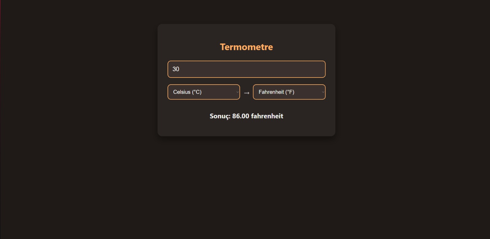

# 🌡️ Termometre Dönüştürücü

Bu proje, farklı sıcaklık birimleri arasında dönüşüm yapmanıza olanak tanıyan basit bir web uygulamasıdır. Kullanıcı dostu arayüzü ve gündüz/gece teması ile modern bir deneyim sunar.

## 🔧 Özellikler

- 6 farklı sıcaklık birimi arasında dönüşüm:
  - Celsius (°C)
  - Fahrenheit (°F)
  - Kelvin (K)
  - Rankine (°R)
  - Réaumur (°Ré)
  - Newton (°N)
- Gündüz/gece saatine göre otomatik tema değişimi (dark/light mode)
- Gerçek zamanlı dönüşüm (anında sonuç)
- Responsive ve modern tasarım

## 📁 Dosya Yapısı

- `index.html` – Uygulamanın HTML iskeleti
- `style.css` – Stil ve tema yönetimi
- `script.js` – Dönüşüm ve tema mantığı

## 🖼️ Görsel

